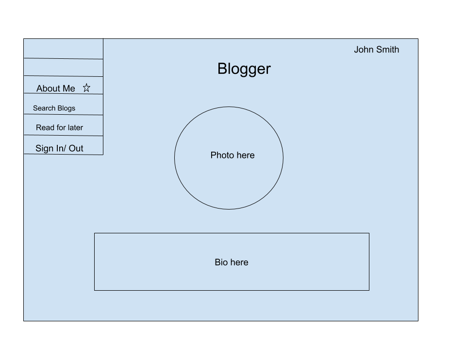
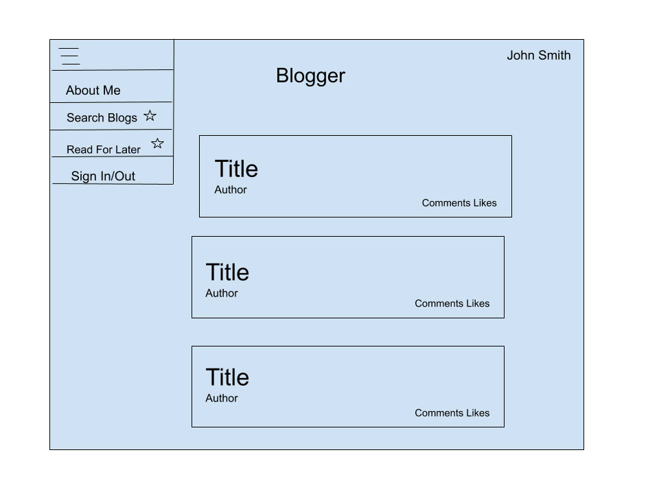
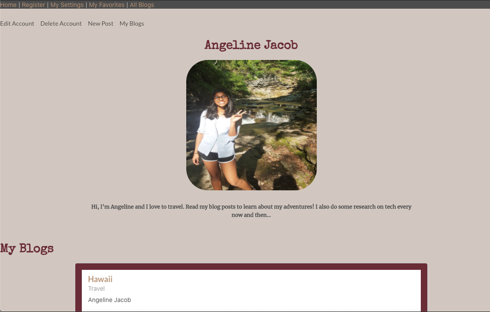
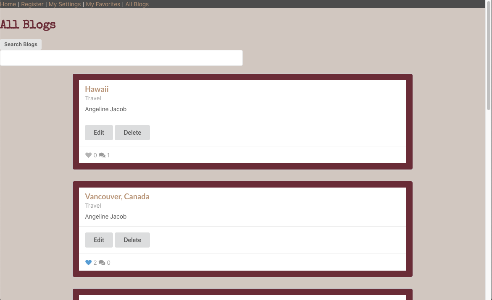

# SEI Project 4 - Blogger

## Description
Blogger is an application where users can create blog posts and share their thoughts with the rest of the world! Users can read all blogs posted by other users and even interact with them through likes and comments. 

You can find Blogger deployed on [Heroku](https://blogger-frontend-angeline.herokuapp.com/), and you can access my backend API [here](https://blogger-backend-angeline.herokuapp.com/).

## Technology Stack
This app was created using the following tech stack:
- [Node and Express (Backend API)](https://github.com/angelinejacob/blogger-backend)
- [React (Frontend)](https://github.com/angelinejacob/blogger-frontend)
- MongoDB & Mongoose (Database)
- Semantic UI
- Axios for API calls to backend

Click the links, to see the Github repos for the Frontend and Backend.

## Wireframes and Planning
Before starting development, I took some time to come up with wireframes and create my data models. This really helped me going forward, because I had a goal I was aiming for. 

### User Bio Page and Blogs Page - Wireframes

The final web design, did differ in some ways to the wireframes, but most of it is the same. 

### User Bio Page and Blogs Page - Actual

## User Stories
1. As a User, I can make an account
2. As a User, I can view blogs written by other users
3. As a User, I can like a blog
4. As a User, I can comment on a blog
5. As a User, I can view individual blog
6. As a User, I can delete their own blogs
7. As a User, I can edit their own blogs
8. As a User, I can save an article to read for later
9. As a User, I can search for article by tags

## Future Features
1. Would like to implement Authentication
2. User can view information on other users
3. User can reply to comments, and like comments
4. Save preferences on the kind of articles you'd like to see when you open the app
5. Would like to create a way for users to direct message one another. Users can have an inbox where they can see messages from others.
6. I would also like to meddle more with the UI, and add some styling features
7. I would like for users to be able to upload images for their profiles, which would then be saved on the Mongo Database
8. Ability to delete  an account

## Known Issues
1. Currently some forms do not refresh when submitted. If the form is opened again, the same values that were previously submitted still stay there. 
2. The Search feature under "All Blogs" is a little buggy. When you backspace your search value, the blogs do not filter out accordingly.

## Favorite Features
1. One of my favorite things about this project was how I was able to reuse one of my React Components (Blog Container) multiple times. I was really able to see how code modularity is very important, and if you do it right, you can reuse one component and avoid writing unecessary code. 
2. Blog Search Feature - I've implemented the ability to search for posts based off of "tags". For example, a blog can have the tags "Science, Medicine" to let other users know what the article is about. Other users can then type "Science" into the search bar to get articles related to Science. I implemented this using the BlogContainer component mentioned above, every time the user strikes a key, the displayed blogs are filtered to match the entered value. These new filtered blogs are then passed into the BlogContainer component and the user can see the results on the screen.

## What I learned
1. I learned that it's important to set realistic expectations on what you can finish 
2. It's important to manage your time - Never spend too much time on 1 feature. When I first started this project, I spent a lot of time figuring out how to upload a photo to mongoDB, after almost two days of trying I had no luck, and decided to move on. This was really valuable time I could have spent trying to build other features.
3. The importance of nesting your components correctly, in a way that data can flow from top-down with React. 
4. Write your backend first!! Initially I tried to develop the frontend and backend simultaneously, however a lot of time was lost using this approach. I think it is always a good idea to finish your backend and test it thoroughly, and then work on the frontend.